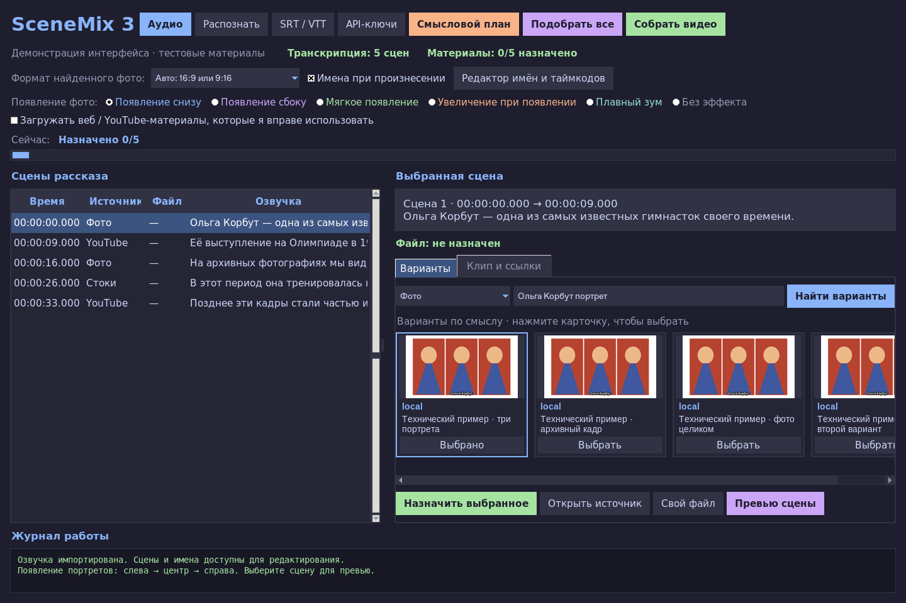

# SceneMix 3 — цветной настольный редактор

Озвучка → смысловой план всего рассказа → люди/события/эпоха → поиск подходящих
фото и видео → монтаж. Прежнее обязательное чередование фото/стоков убрано
из интерфейса. Старые схемы читаются для совместимости проектов.

## Обновление 3

- Тёмное цветное оформление: синие заголовки, зелёные статусы, цветные кнопки
  и эффекты, карточки найденных материалов с превью. Карточки и панели
  адаптируются к размеру окна; журнал остаётся видимым.
- **Авто: 16:9 или 9:16** включено по умолчанию. Поиск принимает фото любой
  ориентации. Широкое фото занимает кадр 16:9; вертикальное появляется как
  портретная композиция. Формат определяется по скачанному файлу, включая
  поворот EXIF. Выбор подходящего сюжета не зависит от ориентации фото.
- При другом соотношении сторон широкое фото вписывается целиком на белом
  фоне, чтобы сохранить края фотографии. Изображение не растягивается.
- Старый стандартный режим «Три портрета» при обновлении становится «Авто».
  Любой принудительный формат по-прежнему доступен в списке или в «Стиль сцены».
- План, оценка найденных материалов и проверка субтитров используют текстовый
  `/v1/chat/completions`, а не генератор поисковых промптов.
- JSON внутри кодового блока или с пояснением читается корректно. Если JSON
  повреждён, модель получает одну просьбу исправить ответ. Неоднозначные,
  оборванные и неверные планы отклоняются до замены существующего проекта.
- **API-ключи → Получить список моделей** позволяет выбрать доступную
  текстовую модель без Терминала. Можно также вписать её ID; пустое поле
  включает автоматический выбор. Ключи сохраняются только локально.



Карточки на снимке — технические примеры интерфейса, не результат онлайн-поиска.

## Что изменилось по видеообразцу

В присланной записи показан горизонтальный документальный ролик: архивные
видеофрагменты, полноэкранные фотографии, три вертикальных портрета,
последовательно появляющихся слева направо на белом фоне, и именные подписи.
Новый режим оформления воспроизводит эти основные приёмы:

- **Автоматически 16:9 / 9:16** — использование подходящего найденного фото
  с выбором композиции по его реальным размерам.
- **Три портрета 9:16** — одна фотография внутри сцены появляется тремя
  колонками, с задержкой 0 / 0.4 / 0.8 секунды. Это композиция одного кадра,
  а не повторяющаяся схема выбора фото и видео.
- **Один портрет 9:16** и **Фото на весь кадр** — альтернативы для разных сцен.
- Появление снизу, сбоку, через прозрачность, с увеличением, плавный зум.
  Стиль можно задать отдельно для сцены.
- Белая подпись имени с тёмной обводкой появляется по таймкоду произнесения.
- Видеодействие длится **до 8 секунд**, затем при необходимости на паузе
  удерживается последний кадр. Автоматического зацикливания нет.
- Итоговый формат по умолчанию — **16:9**; внутри него портреты имеют **9:16**.
  Для вертикального итогового видео три колонки заменяются одним портретом.

Это реализация приёмов из образца, а не покадровая копия его монтажа, логотипа
или всех переходов. Проверенный технический пример —
[examples/SceneMix-style-preview.mp4](examples/SceneMix-style-preview.mp4):
искусственный портрет и тон вместо настоящей озвучки, чтобы показать
последовательное появление и тайминг имени без использования чужого видео.

## Как работает подбор

1. Fast-gen читает весь рассказ, определяет людей, события, места и эпоху.
2. Планировщик объединяет мелкие реплики в смысловые сцены, ориентируясь
   на 6–14 секунд для фото и 6–8 секунд для видео. Это целевой темп, а не
   обязательное чередование источников. Смена предмета рассказа влияет на границы.
3. Для конкретных людей ищутся их портреты, для событий/действий — YouTube
   или архивные видео. Стоки используются для общих действий, а не вместо
   конкретного названного человека.
4. Поисковые запросы сохраняют имена, события и эпоху. Метаданные найденных
   вариантов дополнительно проверяет LLM. В автоматический выбор проходят
   оценки >= 0.8; остальные доступны для ручной проверки.
5. Для YouTube/веб-видео программа ищет подходящий интервал в доступных
   русских/английских субтитрах и проверяет его соответствие рассказу.
   Если интервал не подтверждён, начало ролика автоматически не назначается.
   Можно открыть источник и задать начало вручную.
6. Фото не назначаются повторно по идентификатору/ссылке и отпечатку изображения.
   Из одного YouTube-ролика можно использовать разные непересекающиеся интервалы.
7. Pexels/Pixabay-выдача кешируется на 30 минут. При HTTP 429 запросы к сервису
   приостанавливаются на время Retry-After (или час), включая повторный запуск.
   Программа не требует менять ключ только из-за превышения лимита.

**Ограничение релевантности:** проверяются поисковые метаданные и субтитры.
Программа не распознаёт личности по лицам и не анализирует все кадры видео.
У немых архивных видео без субтитров таймкод нужно задать вручную. Высокая
оценка метаданных — причина предложить материал, а не доказательство его
визуальной точности. Перед длинной сборкой используйте превью сцен.

## Mac: установка и запуск

Нужны Python **3.11+** с Tkinter и FFmpeg/ffprobe. Рекомендуется официальный
установщик **Python 3.12 для macOS** с https://www.python.org/downloads/macos/.
FFmpeg можно установить через Homebrew: `brew install ffmpeg`.

После установки этих двух инструментов откройте **Start-Mac.command**.
Он создаст локальное окружение, установит зависимости и запустит программу.
Если macOS не разрешает открыть скачанный скрипт, нажмите правой кнопкой
в Finder → «Открыть». Это скрипт запуска, не готовое приложение .app.

Ручной вариант из Терминала в папке программы:

```bash
python3.12 -m venv .venv
.venv/bin/python -m pip install -r requirements.lock.txt
.venv/bin/python main.py
```

Дальнейший запуск: `bash start.sh` из этой папки.

## Windows / Linux

На Windows установите Python с опцией Add Python to PATH и FFmpeg в PATH:

```powershell
py -3 -m venv .venv
.venv\Scripts\python.exe -m pip install -r requirements.lock.txt
.venv\Scripts\python.exe main.py
```

Дальнейший запуск — start.bat.
На Linux нужен также python3-tk и графический рабочий стол:

```bash
python3 -m venv .venv
.venv/bin/python -m pip install -r requirements.lock.txt
.venv/bin/python main.py
```

Tesseract необязателен: он добавляет OCR-проверку водяных знаков на фото.
requirements.lock.txt фиксирует проверенные версии зависимостей.

## Ключи без Терминала и скрытых файлов

Нажмите **API-ключи** в окне программы:

- FASTGEN_API_KEY — транскрибация, смысловой план и проверка вариантов.
- Текстовая модель / FASTGEN_TEXT_MODEL — необязательный ID модели Fast-gen.
  Нажмите «Получить список моделей», выберите модель и сохраните настройки.
  Используется список `/v1/models` с запасным `/api/v6/models?media_type=text`.
- PEXELS_API_KEY / PIXABAY_API_KEY — хотя бы один, если нужны стоки.

Значения скрыты в окне, хранятся в локальном `.env`, не выводятся в журнал
и не попадают в Git. Существующие переменные `.env` сохраняются.
Ключ Fast-gen не нужен для ручного монтажа своих файлов, но необходим
для автоматического смыслового плана. Входное аудио Fast-gen: до 25 МБ,
как в исходной интеграции. TLS-проверка включена.

## Работа с новым проектом

1. **Аудио** — откройте озвучку.
2. **Распознать** или **SRT / VTT**.
3. **Смысловой план**: программа перестроит реплики в сцены и определит имена.
4. Включите разрешение загрузки веб/YouTube-материалов, которые вы вправе использовать.
5. **Подобрать все** — уже выбранные файлы сохраняются.
6. Проверьте варианты, причины выбора и оценки. Если сцена пустая, измените
   запрос/источник или добавьте ссылку/свой файл. Нет подтверждённого результата —
   нет случайной автоматической подстановки.
7. **Редактор имён и таймкодов** позволяет исправить имя и секунды появления.
8. **Превью сцены** позволяет проверить оформление до длинного рендера.
   Во вкладке **Клип и ссылки** находятся начало фрагмента, поиск таймкода,
   добавление ссылки, **Стиль сцены**, разрешение готового видео и субтитры.
9. **Собрать видео**.

Формат фото по умолчанию — **Авто: 16:9 или 9:16**. Он переключается для
каждого найденного изображения, без обязательного чередования ориентаций.
Во вкладке «Клип и ссылки» задаётся формат готового ролика; по умолчанию 16:9.
Полные субтитры по умолчанию выключены; именные титры включены.
При наличии word timestamps имена привязаны к слову в озвучке.
В SRT/VTT время слов оценивается равномерно внутри реплики; редактор явно
отмечает его как примерное. Проверяйте и поправляйте такое время вручную.
Имена появляются при произнесении имени/его формы, а не на каждом местоимении «она».

## Обновление и старый проект

Скопируйте свой `.env` в новую папку или впишите ключи через кнопку.
Не удаляйте папку `<имя_озвучки>_project` с существующими материалами.
Откройте прежнюю озвучку и нажмите **Смысловой план**, чтобы заменить старую
раскадровку. Перед заменой автоматически сохраняется
`project.before-plan.<дата>.json`. Загруженные файлы не удаляются.
Новый подбор не меняет уже выбранные файлы без пересоздания плана/снятия назначения.
При сбое планирования старый проект остаётся рабочим.

Результат: `<имя_озвучки>_project/final_video.mp4`, рядом SRT, список источников
`.sources.json` и именные таймкоды `.names.json`. Проект — project.json.
Сборка останавливается при отсутствующих файлах, неправильном тайминге или
битых клипах; чёрные заглушки автоматически не вставляются.

## Проверки

```bash
python -m unittest discover -s tests -v
python tests/smoke_render.py /tmp/scenemix-demo
python tests/smoke_style.py /tmp/scenemix-style
python tests/smoke_auto_format.py /tmp/scenemix-auto
python main.py --doctor
```

GUI-тестам нужен графический дисплей. Smoke-тесты создают технические медиа,
проверяют реальный порядок/паузы, сохранение аудио, число кадров, появление
трёх портретов, включение/выключение титра и остановку движения после 8 секунд.
Также есть CLI `--render AUDIO` и `--autopick AUDIO` для сохранённого проекта.

В облаке проверены логика, настольное окно и реальные рендеры. Смысловой
план/ранжирование проверены тестовыми ответами API; живых ключей Fast-gen,
Pexels/Pixabay в среде нет, а YouTube/поисковые сайты ограничены сетью.
Поэтому полная онлайн-цепочка ещё не проверена на пользовательской озвучке.
Обновлённый текстовый клиент проверен на тестовых HTTP-ответах: JSON/fences,
повторное исправление, отказ response_format, ошибки доступа и лимит ответа.
Доступность chat/completions и конкретной модели с вашим аккаунтом должна
быть подтверждена при запуске с вашим ключом.
YouTube может менять протокол/ограничивать доступ; при таких ошибках обновите
yt-dlp в своём окружении или выберите другой источник. Обход ограничений
доступа не реализован.
