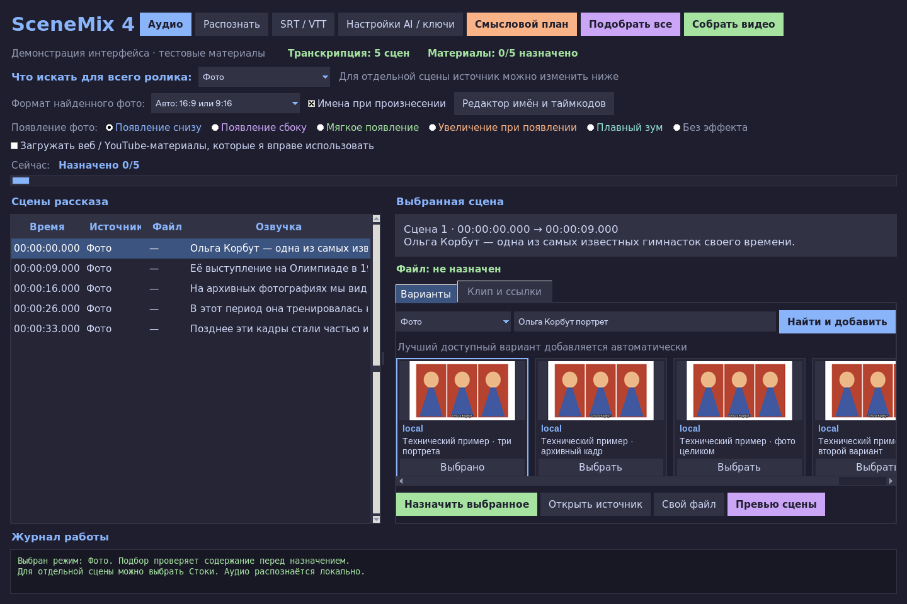

# SceneMix 4 — фото или стоки по смыслу рассказа

Настольная программа для Mac: озвучка → распознавание → смысловой план →
поиск → проверка содержимого → автоматический монтаж. Fast-gen удалён:
его ключи и сервисы больше не используются.



## Что изменилось

- **Что искать для всего ролика:** «Фото», «Стоки», «По смыслу», YouTube или
  интернет-видео. Выбранный источник сохраняется в проекте.
- Источник выбранной сцены меняется отдельным списком рядом с поисковым
  запросом. Выбор сохраняется сразу, до запуска поиска. Он имеет приоритет
  над общим режимом. Новый выбор общего режима сбрасывает эти исключения.
- «Фото» ищет фотографии; «Стоки» ищет стоковое видео Pexels/Pixabay и
  **не заменяет его фотографиями**, если выдача недоступна. Автоматический
  режим может подставить подходящее фото вместо недоступного видео.
- Распознавание — **локальный Whisper**, с пословными таймкодами. Аудио
  остаётся на ноутбуке; ограничения на размер 25 МБ больше нет.
- Анализ рассказа — **OpenAI напрямую** или **Ollama на ноутбуке**.
  Модель получает контекст всего рассказа, соседние реплики, имена, события,
  места и эпоху. При переключении источника запрос уточняется под новый тип.
- Проверяются названия/источники и превью; перед автоматическим назначением
  проверяется скачанное фото либо три кадра используемого видеоклипа.
  Несоответствующие материалы пропускаются, поиск продолжается автоматически.
- Название с подходящим ключевым словом само по себе не означает совпадение.
  В проекте сохраняются результат проверки и причина выбора. Если анализ
  недоступен, неподтверждённые материалы не назначаются как готовые; повторный
  автоподбор продолжит работу после восстановления сервиса.
- Разные действия одного человека не склеиваются только из-за одинакового
  имени. Нет обязательного повторения «фото → видео → фото».
- Старые автоматически подобранные файлы без проверки проверяются повторно;
  при отказе программа ищет замену, сохраняя прежние файлы на диске. Собственный
  файл или явно назначенный вручную материал считается выбором пользователя.

Это проверка соответствия сюжету, а не распознавание личности по лицу.
Для названных людей учитываются имя и источник материала. Модель не может
гарантировать подлинность архивной подписи. В режиме стоков актёр иллюстрирует
действие и не выдаётся за названного исторического человека.

## Запуск на Mac

Нужны **macOS 13+**, официальный **Python 3.12 с Tkinter** и **FFmpeg/ffprobe**.
Готовые зависимости подобраны для Intel и Apple Silicon.

1. Распакуйте ZIP из репозитория.
2. Откройте **Start-Mac.command** двойным щелчком. Если macOS блокирует запуск,
   используйте правую кнопку → «Открыть». Первый запуск устанавливает зависимости.
3. В программе откройте **Настройки AI / ключи**. Редактировать `.env` через
   терминал не нужно.
4. Выберите вариант анализа ниже и сохраните настройки.
5. Откройте озвучку через **Аудио**. Нажмите **Распознать** либо импортируйте
   уже готовый **SRT / VTT**.
6. Выберите **Что искать для всего ролика** и нажмите **Подобрать все**.
   Программа сама создаст смысловой план, найдёт, проверит и назначит материалы.
7. При необходимости измените источник отдельной сцены и нажмите
   **Найти и добавить**. Карточки вариантов остаются доступны для ручной замены.
8. **Превью сцены** проверяет оформление; **Собрать видео** запускает монтаж.
   При недостающих или неподтверждённых материалах сначала выполняется автоподбор.

Если Python/FFmpeg уже установлены для предыдущей версии, переустановка не нужна.
Python: https://www.python.org/downloads/macos/.
FFmpeg через Homebrew: `brew install ffmpeg`.
На первом запуске Whisper скачает выбранную модель с Hugging Face. `small` —
базовый компромисс для ноутбука; `medium` обычно точнее и заметно медленнее.
Можно указать путь к заранее скачанной CTranslate2-модели. Модели кешируются
в `~/.cache/scenemix/whisper`; длительная озвучка требует времени на распознавание.
По умолчанию язык `ru`; пустое поле включает определение языка.

## Варианты анализа смысла и изображений

### OpenAI напрямую

В настройках выберите `openai`, вставьте **OPENAI_API_KEY**, оставьте модель
`gpt-4.1-mini` или укажите другую совместимую модель с поддержкой изображений.
Запросы направляются непосредственно в `https://api.openai.com/v1`.

API оплачивается отдельно от подписки ChatGPT. Для проверки передаются текст
рассказа и изображения/кадры. Аудио распознаётся локально. В облачной среде
разработки ключ отсутствует; успешная работа с конкретным аккаунтом не проверена.

### Ollama на ноутбуке

Установите приложение https://ollama.com и модель с поддержкой изображений,
например `gemma3:4b`. В настройках SceneMix выберите `ollama`, модель
`gemma3:4b` и адрес `http://localhost:11434/v1`. Ключ OpenAI не требуется.
Приложение Ollama должно быть запущено. Установка модели выполняется в Ollama,
SceneMix не скачивает её автоматически. Для длинного рассказа запрашивается
контекст 32768 токенов; скорость и доступный размер модели зависят от памяти Mac.
Текстовая модель без поддержки изображений не подходит для проверки кадров.

### Стоки

Для режима «Стоки» добавьте хотя бы один ключ:

- **PEXELS_API_KEY:** https://www.pexels.com/api/
- **PIXABAY_API_KEY:** https://pixabay.com/api/docs/

Веб-поиск фотографий выполняется без отдельного ключа поиска.
При HTTP 429 запросы к стоку временно приостанавливаются; менять ключ не требуется.
Для веб/YouTube включите соответствующее разрешение в интерфейсе. Поддерживаются
сайты yt-dlp. Интервал YouTube подбирается по субтитрам; без подтверждённого
совпадения программа не берёт первые восемь секунд наугад. Загрузка фрагмента
ограничена восемью секундами. Доступность YouTube зависит от сети и ограничений
платформы. Обход ограничений доступа не реализован.

## Фото, эффекты, имена и таймкоды

- Поиск принимает фото **16:9 и 9:16**. Широкое фото показывается целиком;
  вертикальное — портретной композицией. Формат определяется по файлу, включая
  поворот EXIF. Принудительное чередование ориентаций отсутствует.
- Три портрета появляются слева → центр → справа на светлом фоне. Доступны
  появление снизу/сбоку, мягкое появление, увеличение, плавный зум и отсутствие
  эффекта. Формат и эффект можно изменить для отдельной сцены.
- Имена появляются при произнесении имени или его формы. Время берётся из
  пословных таймкодов; в SRT/VTT оно оценивается и помечается как приблизительное.
  Есть редактор имён и таймкодов. Полные субтитры по умолчанию выключены.
- Обычные пересечения соседних сцен/слов исправляются автоматически. Паузы
  сохраняются, последующие сцены не сдвигаются, озвучка не сокращается.
  Перед исправлением старого проекта создаётся `project.before-timing.…json`.
  Неверные числа, обратный порядок сцен или конец раньше начала не подменяются
  придуманными таймкодами.

## Старые проекты и результаты

Не удаляйте папку `<имя_аудио>_project` рядом с озвучкой. В новой версии откройте
**тот же аудиофайл**. При первом новом автоподборе смысловой план обновляется
под новые условия; предыдущий проект сохраняется как `project.before-plan.…json`.
Существующие материалы и резервные копии не удаляются. Ручные назначения для
сцен с тем же текстом и границами переносятся в обновлённый план.

Ключи новой версии вводятся через окно настроек; старый ключ не переносится
на новый сервис. `.env`, ключи, модели и пользовательские проекты не публикуются.

Готовый ролик: `<имя_аудио>_project/final_video.mp4`. Рядом — SRT, список
источников `.sources.json` и именные таймкоды `.names.json`.
Сборка не создаёт чёрных заглушек при недостающих или повреждённых материалах.

## Разработка и проверки

```bash
python3.12 -m venv .venv
.venv/bin/python -m pip install -r requirements.lock.txt
bash start.sh --doctor
.venv/bin/python -m unittest discover -s tests -v
.venv/bin/python tests/smoke_render.py /tmp/scenemix-demo
.venv/bin/python tests/smoke_style.py /tmp/scenemix-style
.venv/bin/python tests/smoke_auto_format.py /tmp/scenemix-auto
```

GUI-тестам нужен графический дисплей. Проверки охватывают выбор источника,
запрет подмены стоков фотографиями, отказ визуально неподходящим результатам,
приостановку назначения при сбое анализа, прямые HTTP-протоколы OpenAI/Ollama,
таймкоды Whisper, отмену распознавания, старые проекты и реальные рендеры FFmpeg.
Ответы моделей в тестах подставляются: это проверяет поведение программы,
но не измеряет точность конкретной модели на пользовательском рассказе.
В облаке отсутствует ключ OpenAI, а скачивание Whisper/Ollama-моделей ограничено
сетью. Проверены установленные декодер/VAD, интерфейс, сценарии обработки
тестовых ответов и рендер. Полная онлайн-цепочка и распознавание пользовательской
озвучки живой моделью здесь не проверены.
