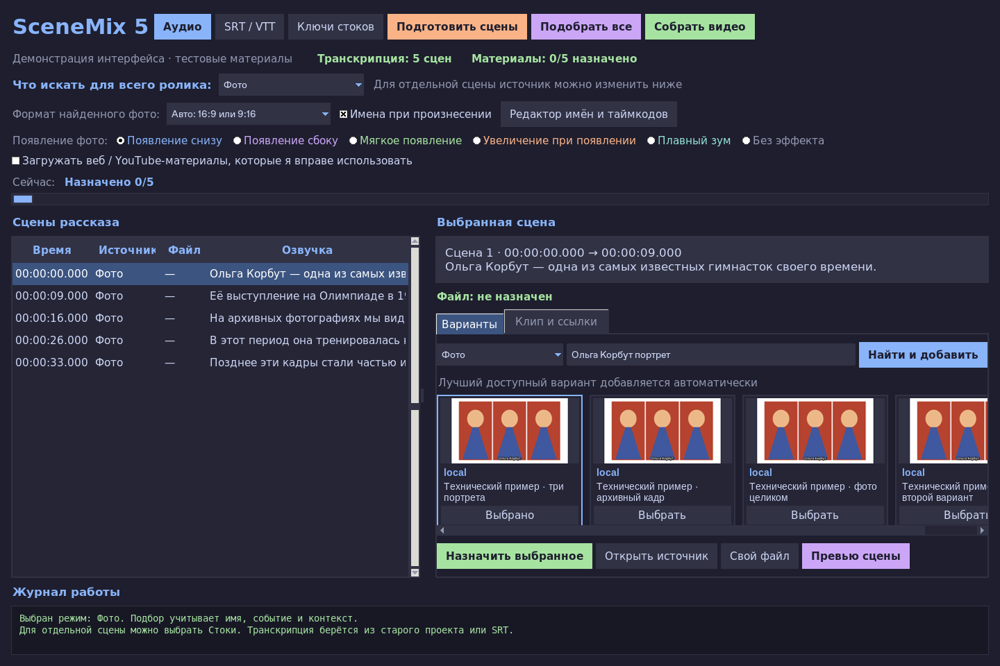

# SceneMix 5 — фото и стоки по контексту рассказа

Настольная программа для Mac: сохранённая транскрипция / SRT → подготовка
сцен → автоматический поиск и назначение материалов → монтаж с озвучкой.
В рабочем интерфейсе **не нужны Fast-gen, OpenAI, Ollama или скачивание моделей**.



## Подбор без AI-сервисов

Запросы строятся правилами по именам, датам, местам, темам и действиям.
Предыдущие реплики помогают связать «она» с недавно названной героиней.
Например, после «Ольга Корбут, Олимпиада 1972 года» слова «она выступила
на брусьях» дают фото-запрос с именем, упражнением и годом; для стоков —
`gymnast uneven bars`. При смене героя прежнее упражнение не переносится.
Имя из следующей сцены не подставляется в предыдущую.

Словарь правил ограничен. Он не понимает любой рассказ, сложные местоименные
связи или скрытый смысл. Результаты сравниваются по словам в названии и пути
ссылки; **содержимое фото/видео не распознаётся**. Метка «по словам» обозначает
совпадение слов, а не вероятность правильности кадра. Подлинность фотографии
и соответствие конкретному историческому событию не гарантируются.

Программа сама пробует лучшие результаты, пропускает повреждённые файлы,
повторы и явно неподходящие названия. Выбирать каждый файл вручную не нужно.
Если все подходящие ссылки недоступны, автоподбор завершится с сообщением
и сохранит проект; повторный запуск продолжит поиск. Неограниченная доступность
материалов в интернете не гарантируется.

## Запуск на Mac

Нужны Python 3.11+ с Tkinter и FFmpeg/ffprobe, как для прежних программ.
Рекомендуется официальный Python 3.12. Если они уже установлены,
переустанавливать их не нужно. Дополнительные приложения для AI не требуются.

1. Распакуйте ZIP и откройте **Start-Mac.command** двойным щелчком.
   При блокировке macOS используйте правую кнопку → «Открыть».
   Первый запуск установит обычные Python-зависимости редактора.
2. Откройте **Аудио** и выберите прежнюю озвучку. Сохраните рядом с ней папку
   `<имя_аудио>_project` из старой программы: её транскрипция загрузится сама.
   Например, для `result.mp3` нужна прежняя папка `result_project`.
3. Если старого проекта нет, нажмите **SRT / VTT** и импортируйте субтитры.
   Файл с тем же именем рядом с аудио (`result.srt` или `result.vtt`)
   загружается автоматически, если в проекте ещё нет транскрипции.
4. Для стоков откройте **Ключи стоков** и вставьте хотя бы один ключ Pexels
   или Pixabay. Для фото отдельный ключ поиска не нужен. Терминал для ключей
   не требуется.
5. Выберите **Что искать для всего ролика**: «Фото», «Стоки» или «По смыслу».
   Нажмите **Подобрать все**: подготовка сцен и назначение файлов выполняются
   автоматически. **Подготовить сцены** позволяет сначала посмотреть запросы.
6. Нажмите **Собрать видео**. **Превью сцены** показывает её оформление.

Распознавание новой озвучки внутри этой версии не выполняется: для него
нужен сервис или модель. Используйте транскрипцию / субтитры из прежнего софта.
При импорте SRT/VTT пословные времена оцениваются; именные титры могут требовать
поправки в редакторе имён и таймкодов.

Python для Mac: https://www.python.org/downloads/macos/.
Если FFmpeg отсутствует, стандартная установка через Homebrew: `brew install ffmpeg`.

## Фото, стоки и видеофрагменты

- Общий режим сохраняется в проекте. Для отдельной сцены источник меняется
  списком рядом с запросом; выбор сохраняется сразу. Новый общий режим
  сбрасывает исключения отдельных сцен.
- «Фото» ищет фото; «Стоки» ищет Pexels/Pixabay и не заменяется фотографиями.
  Автоматический режим выбирает по правилам: люди → фото, известные действия
  без конкретного героя → стоки. Повторяющейся схемы фото–видео–фото нет.
  Стоковый актёр иллюстрирует действие и не обозначается названным человеком.
- Для стоков: https://www.pexels.com/api/ и https://pixabay.com/api/docs/.
  При HTTP 429 провайдер временно приостанавливается; менять ключ не нужно.
- YouTube и интернет-видео можно выбрать общим или отдельным режимом.
  Включите соответствующую галочку загрузки в интерфейсе. Интервал подбирается
  по словам в субтитрах и ограничен **8 секундами**. Без совпадения в субтитрах
  первые восемь секунд наугад не берутся. Доступность зависит от источника и сети.
- Карточки и редактирование запроса остаются доступны для необязательной
  замены. «Найти и добавить» назначает лучший доступный результат автоматически.

## Оформление и сохранение проекта

- Фото принимаются **16:9 и 9:16**. Поиск не ограничивается вертикальными
  снимками. Формат определяется по найденному файлу с учётом EXIF.
- Есть широкий кадр, один портрет и три портрета с появлением слева → центр
  → справа. Эффекты: появление снизу/сбоку, мягкое появление, увеличение,
  плавный зум. Формат и эффект можно менять для отдельной сцены.
- Сцены группируются по репликам и теме. Фото ограничены 14 секундами,
  видео — 8; короткие самостоятельные события могут дать более короткие сцены.
- Именные титры создаются для распознанных правилами имён и их произнесённых
  форм. Пословные таймкоды старого проекта сохраняются; в SRT/VTT времена
  приблизительные. Нераспознанное имя можно добавить в редакторе титров.
- Обычные пересечения таймкодов исправляются автоматически с резервной копией.
  Озвучка и последующие сцены не сдвигаются. Некорректные числа и обратный
  порядок сцен не заменяются придуманными временами.

Старый план обновляется при первом автоподборе. Предыдущий `project.json`
сохраняется как `project.before-plan.…json`; исправление времён создаёт
`project.before-timing.…json`. Файлы и назначения с тем же текстом и границами
сохраняются. Старые настройки обязательного AI-анализа отключаются при открытии.

Результат: `<имя_аудио>_project/final_video.mp4`, рядом — SRT, список источников
`.sources.json` и именные времена `.names.json`. Ключи сохраняются локально
в `.env`; пользовательские ключи, проекты и видео-пример в репозитории отсутствуют.

## Разработка и проверки

```bash
python3.12 -m venv .venv
.venv/bin/python -m pip install -r requirements.lock.txt
bash start.sh --doctor
.venv/bin/python -m unittest discover -s tests -v
.venv/bin/python tests/smoke_render.py /tmp/scenemix-demo
```

GUI-тестам нужен дисплей. Проверены контекстные запросы без сети/AI, смена
имён и действий, сохранение текста, выбор источника, автоматическое назначение,
импорт старого проекта и SRT, исправление таймкодов, интерфейс и рендер FFmpeg.
Новая установка проверена без Whisper и пакетов моделей. Сетевые ответы
провайдеров в тестах подставляются; доступны также проверки локальной HTTP-загрузки.
Живой поиск по пользовательской озвучке здесь не проверен: облачная сеть
не предоставляет доступ к медиасервисам, ключи стоков отсутствуют.
